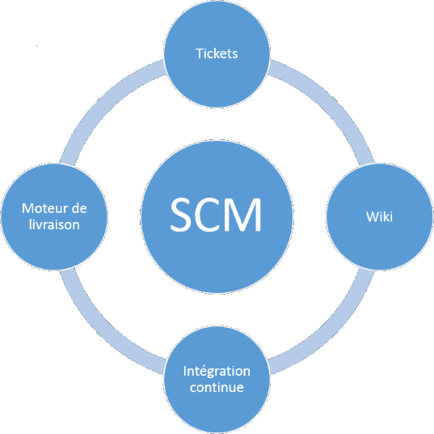
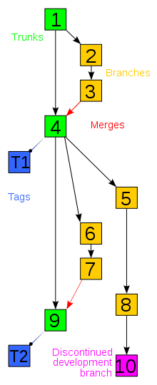

= data-scale='10'
---
= data-scale='6'
# O.D.E.V.A.

**O**utils supportant le **DEV**eloppement, le déploiement et la maintenance collaborative des **A**pplications

---
= data-x='-1000' data-y='-3000' data-scale='4'
# Projet

---
= data-x='-2000' data-y='-3500'
# Cycle de vie

 * Analyse
 * Développement
 * Livraison / Recette
 * Mise en production
 * Maintenance

---
= data-x='-2000' data-y='-2750'
# Pas si simple

 * Livraison par bloc
 * Travail en équipe (offshore)
 * Maintenance (plusieurs années)
 * Plusieurs clients
 * Stress
 * Qualité

---
= data-x='-2000' data-y='-2000'
# Besoin d'outils



---
= data-x='2000' data-y='-3000' data-scale='4'
# Autres outils

---
= data-x='1000' data-y='-3500'
# Wiki

 * Seule source 100% fiable
 * Ouvert à l'extérieur
 * Construit au fur et à mesure
 * Aide mémoire.

---
= data-x='1000' data-y='-2750'
# Intégration continue
 * Jenkins, Teamcity, Bamboo, Travis, ...
 * Compilation automatique
 * Test unitaires
 * Test d'intégration
 * Génération artefacts

---
= data-x='1000' data-y='-2000'
# Déploiement auto
 * Cela devient une réalité
 * Déploiement simplifié.
 * Github, Facebook, Google

---
= data-x='0' data-y='-3000' data-scale='4'
# SCM

---
= data-x='-1000' data-y='-3500'
# Lexique

 * SCM (**S**ource **C**ode **M**anagement)
 * VCS (**V**ersion **C**ontrol **S**ystem)
 * SCV (**S**ystême de **C**ontrôle de **V**ersion)

---
= data-x='-1000' data-y='-3500' data-z='-9000'
# Historique

 * SCCS: 1972, Bell Labs, Marc J. Rochkind
 * diff: 1974, AT&T, Hunt-McIlroy algorithm
 * RCS: 1982, GNU, Walter F. Tichy
 * patch: 1985, Larry Wall
 * CVS: 1986, Dick Grune
 * Subversion: 2000, CollabNet, Apache
 * Git: 2005, Linus Torvalds

---
= data-x='-1000' data-y='-3500' data-z='-18000'

# 2014

Toutes les sociétés n’utilisent pas encore de SCM !

---
= data-x='-1000' data-y='-2750'
# Principe
 * Plusieurs développeurs travaillent ensemble sur le même projet
 * Chacun dispose de sa copie locale
 * Chacun met à disposition des autres les dernières modifications
 * Co-développement, contrôle de distributions, maintenance.
 * Évolution des changements subis par un ensemble de fichiers

---
= data-x='-1000' data-y='-2000'



---
= data-x='1000' data-y='-3000' data-scale='4'
# Tickets

---
= data-x='0' data-y='-3500'
# Principe

 * Liste de choses à faire !
 * Ne pas oublier les petites tâches.
 * Les relire constamment.
 * Aide mémoire.

---
= data-x='0' data-y='-2750'
# Comment bien les utiliser
 * Qui, Quand, Quoi, Pourquoi, Comment, Ou ?
 * Catégorie : Bug, Evolution, ...
 * Étiquettes (Tag).
 * Jalon (Milestone).
 * Propriétaire.
 * Ordonnancement.
 * Phrases à bannir !

---
= data-x='0' data-y='-2750' data-z='-9000'
# Worflow


---
= data-x='0' data-y='-2000'
# Historique
 * Historique d'un client.
 * Qu'est ce qui a été livré ?
 * Comment a-t-on clôturé un ticket ?
 * Statistiques.

---
= data-x='500' data-y='1450' data-scale='3'

# Petit projet ?

---
= data-x='-2000' data-y='1250'
# Exemple petit projet individuel

 * Un service REST en PHP
 * Un contrôleur AngularJS en Javascript
 * Une vue HTML
 * Des dépendances externes (librairies AngularJS, framework CSS, framework PHP, ...)

---
= data-x='-1000' data-y='1250'
# Architecture

```bash
user@home:~/src/projet1# ls
Modele.php
Controleur.js
Vue.html
vendor
```

---
= data-x='-1000' data-y='2000' data-rotate='-45'
# Nouveaux besoins

 * L'évolution d'un projet informatique n'est pas linéaire (beaucoup de retours en arrière).
 * Besoin de sauvegarde.
 * Envie de garder à disposition la dernière version fonctionnelle.

---
= data-x='0' data-y='1250'
# Nouvelle architecture

```bash
user@home:~/src/projet1# ls
Modele.bak
Modele.php
Controleur.bak
Controleur.js
Vue.bak
Vue.html
vendor
```

---
= data-x='0' data-y='2000' data-rotate='-45'
# Nouveaux besoins

 * Besoin de sauvegardes plus anciennes
 * Besoin de trouver des ensembles cohérents

---
= data-x='1000' data-y='1250'
# Nouvelle architecture

```bash
user@home:~/src/projet1# ls
Modele.php.20140302
Modele.php.20140407
Modele.php
Controleur.js.20140302
Controleur.js
Vue.html.20140407
Vue.html
vendor
```

**Cela commence à être complexe**

---
= data-x='1000' data-y='2000' data-rotate='-45'
# Nouveaux besoins

 * Sauvegarde historisée (mail, dropbox, ...).
 * Un fichier texte est ajouté sur chaque répertoire pour préciser ce qui est fait et ce qui reste à faire (aide mémoire).
 * Utilisation régulière de la commande `diff` pour se souvenir des différences de code.

---
= data-x='2000' data-y='1250'
# Deux semaines après : besoin de cohérence

```bash
user@home:~/src# ls
projet1_20140502
projet1_20140503
projet1_20140504
projet1
```

---
= data-x='2000' data-y='2000' data-rotate='-45'
# Bilan sur un projet individuel

 * Besoin d'un historique.
 * Besoin de sauvegarde.
 * Besoin de cohérence.
 * Besoin d'un aide mémoire (texte, `diff`)

---
= data-x='500' data-y='3450' data-scale='3'

# Subversion

---
= data-x='-2000' data-y='3250'
# Création

```bash
cd /home/user/svn
svnadmin create monProjet
mkdir /tmp/Projet
mkdir /tmp/Projet/branches
mkdir /tmp/Projet/tags
mkdir /tmp/Projet/trunk
svn import /tmp/Projet file:///home/user/svn/monProjet -m "Import initial"
```

---
= data-x='-2000' data-y='3250' data-z='-9000'
# Copie locale

```bash
cd /home/user/src
svn co file:///home/user/svn/monProjet/trunk maCopieLocale
```

---
= data-x='-2000' data-y='3250' data-z='-18000'
# svnserve / Apache (dav)

```bash
vi /home/user/svn/monProjet/conf/svnserve.conf
# anon-access = read -> anon-access = write
svnserve -d -r /home/user/svn --listen-port 45001 --foreground
```

```bash
svn co svn://ip:45001/monProjet/trunk distance
```

---
= data-x='-1000' data-y='3250'
# Check in / Commit


```bash
svn add list.txt
(Modifier le fichier)
svn status
svn ci list.txt -m "Ajout de XXX dans la liste"
```

---
= data-x='-1000' data-y='3250' data-z='-9000'
# Check out / Mise à jour


```bash
svn co http://path/to/trunk
svn up
svn revert list.txt
```

---
= data-x='0' data-y='3250'
# Historique / Différences


```bash
svn log list.txt
svn diff -r3:4 list.txt
```

---
= data-x='1000' data-y='3250'
# Etiquettes / Version


```bash
svn copy http://path/to/revision http://path/to/tag
```

---
= data-x='2000' data-y='3250'
# Branches


```bash
svn copy http://path/to/trunk http://path/to/branch
```

---
= data-x='2000' data-y='3250' data-z='-9000'
# Fusion


```bash
svn merge -r5:6 http://path/to/branch
```

---
= data-x='2000' data-y='3250' data-z='-18000'
# Conflits


Gestion manuelle la plupart du temps.


---
= data-x='-6000' data-y='2200' data-scale='4'

# Grand pouvoirs

---
= data-x='-7000' data-y='1700'
# Intérêts

 * Avoir le droit de changer d’avis
 * Tester des idées sans conséquence
 * Collaborer avec d’autres personnes
 * Faciliter la **maintenance** ou le déboggage

---
= data-x='-7000' data-y='2700'
# Intérêts (suite)
 * Générer des statistiques
 * Gagner du temps
 * Garder sa santé mentale

---
= data-x='-6000' data-y='1700'
# Intérêts (suite)
 * Log
 * Blame / Annotate
 * Bisect

---
= data-x='-6000' data-y='1700'
# Revue de code

Pas de revue de code sans gestionnaire de source.

Excellent moyen d'apprendre !

---
= data-x='-4000' data-y='2200' data-scale='4'

# Grandes responsabilités

---
= data-x='-5000' data-y='1700'
# Rien de magique !

 * Un SCM mal utilisé sera certainement plus pénalisant que de ne pas en utiliser.
 * Ce n'est pas le SCM qui va permettre de gérer la communication autour du projet.
 * Un SCM se sauvegarde !
 * Ne jamais toucher aux fichiers internes (.svn, .git, ...)

---
= data-x='-5000' data-y='2700'
# Fichiers à exclure

## Règles fermes

 * Aucun résultat de compilation (dll, jar, ...)
 * Aucun fichier spécifique à un ordinateur (préférences, lien d'accès à une base de données, ...)
 * Les fichiers à exclure doivent être **ignorés** (svn:ignore, .hgignore, .gitignore)

---
= data-x='-5000' data-y='2700' data-z='-9000'
# Fichiers à exclure

## Règles négociables

 * Aucun executable ou limiter les fichiers binaires.
 * Limiter les librairies externes (privilégier si possible les outils comme composer, gradle, bower, maven, ...)

---
= data-x='-4000' data-y='1700'
# Validation (commit)

## Respecter l'équipe

 * Avant un commit, il faut rafraichir sa copie locale (récupérer les modifications des collaborateurs).
 * Avant de faire un commit, les modifications doivent être testées (par le développeur et via des tests unitaires le cas échéant).
 * Un commit doit avoir un message explicite en bon français.

---
= data-x='-4000' data-y='2700'
## Garder la cohérence

 * Un commit ne mélange pas le fond et la forme.
 * Un commit = Un objectif.
 * La suppression ou le renommage se font avec le SCM
 * Les commits doivent être fréquents.
 * Un commit doit être relu.
 * Un commit doit se suffire à lui même.
 * A vous ...

---
= data-x='-4000' data-y='2700' data-z='-9000'
# TOP 10 des pires messages

 * Some shit.
 * It works!
 * fix some fucking errors
 * fix
 * Fixed a little bug...
 * Updated
 * typo
 * Revision 1024!!

---
= data-x='-3000' data-y='1700'

# Conflits

 * Ne pas se lancer la patate chaude.
 * Etre adulte.
 * Un conflit n'est pas à cause de l'autre.

---
= data-x='-3000' data-y='2700'
# Règles à suivre

 * Avoir des conflits est normal dans un projet.
 * Règles définies = Moins de conflits.
 * Résoudre un conflit nécessite une reflexion.
 * Si votre SCM détecte un conflit alors sans SCM il y aurait eu de la perte de code.

---
= data-x='3000' data-y='0' data-rotate='90' data-scale='3'

# Git

---
= data-x='3000' data-y='-3000' data-rotate='90'
# Centralisé


---
= data-x='3000' data-y='-2000' data-rotate='90'

# Décentralisé / Distribué


---
= data-x='3000' data-y='-1000' data-rotate='90'

# Avantages DVCS

 * L'historique des versions est toujours disponible
 * Les commits sont toujours possibles (même offline)
 * Beaucoup plus rapide
 * Facilité de création de branches
 * Moins de maintenance

---
= data-x='3000' data-y='0' data-rotate='90'

# Plus de complexité

 * La manière de collaborer n'est pas forcée par le système
 * Impossible de savoir ou est la dernière version
 * Besoin de cadrer l'organisation.
 * Les numéros de version sont des GUID

---
= data-x='3000' data-y='1000' data-rotate='90'

# Push / Pull


---
= data-x='3000' data-y='2000' data-rotate='90'

# Github / Pull request

 * Les contributeurs font des PR
 * Le mainteneur les accepte, les refuse ou demande des modifications
 * Notion de `rebase` pour réécrire l'histoire.
 * Git flow

Nouveau rôle : Intégrateur.

---
= data-x='3000' data-y='3000' data-rotate='90'

# Les commandes GIT

 [La meilleure source à mon avis](http://ndpsoftware.com/git-cheatsheet.html)